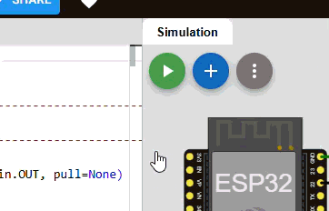
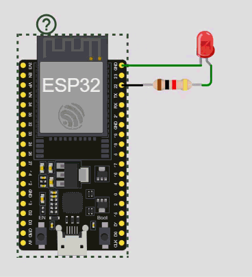
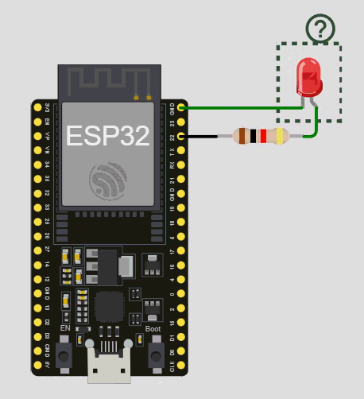
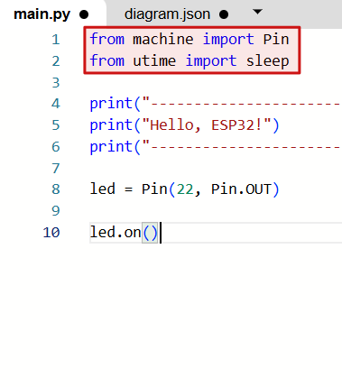
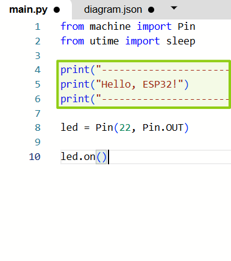
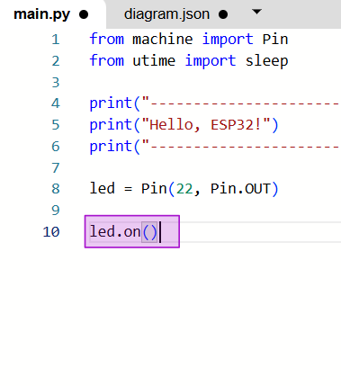
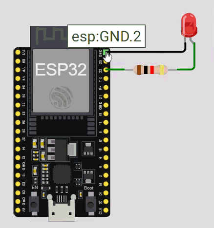
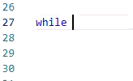

# Wokwi exercise 1 LED blinking

Open the link to the exercise on the Wokwi platform: [https://wokwi.com/projects/447622876562861057](https://wokwi.com/projects/447622876562861057).

<br>
In front of you, you will see two panes: 
<br>

| Left pane with code | Right pane with your setup |
| ------------------ | ------------------------- |
|||

<br>

You can see some simple code and on the right a simulated device with a circuit connected to it. **Go ahed and upload the code and execute it in the simulated device.**



## Simulated electronic setup

Let's focus on the right pane with your setup first.


| Control unit HUZZAH32 | LED (a light emitting diode) | Resistor |
| --------------------- | ---------------------------- | -------- |
|  |  |  |
| This is the device you will be programming. | LED will help you visualize your code. | It is crucial to add a resistor in the line.

<br>

> ⚠️ Resistor is a crucial part of this circuit. An LED alone does not provide enough resistance and without sufficient resitance, too much current will flow through your circuit and it will potentially damage your LED or the control unit!

<br>

## Coding pane

Let's parse the coding pane to understand how to structure basic python script. If you already have an experience with this, you can just skim through this section. 

<br>

| Header | Intro message | Setup | Actual script | 
| ------ | ------------- | ----- | ------------- |
|  |  |  |  |
| The header is where you load modules or their subpars. More bellow. | Intro message is optional, but provides a good way to check your code. | Setup is where you assign pins and their functions, variables etc. | Finally your actual code will follow. The code here is very short. | 

<br>

### Header and setup code

In the example above, we are loading two functions from two separate modules. It is often a good idea to load only specific required parts of a larger module for faster loading and more efficient code, but it is not always practical. 

The first module we are loading is called `machine` and we are loading a class `Pin`. This allows us to activate pins we would like to work with on our development board. To select a pin, simply pass its number into the function by placing it into the parantheses behind the function name e.g. `Pin(22)` will enable pin 22. 

Pins can be functioning as output, where a voltage is change according to instructions in a program, or input, where a pin detects high or low voltage applied to it. In our case, we want to declare an output pin, which is done using an argument `mode`  and passing it a value `Pin.OUT`. In our example it can be `Pin(22, mode=Pin.OUT)`.

<br>

---

:bulb: `Pin.OUT` is actually just a variable holding an integer (numerical value). You can check what this value is by printing it using the following code 
```
print("Pin.OUT value:")
print(Pin.OUT)
```

Note that when we write `"Pin.OUT"` within quotation marks, it gets just printed. We call anythign within quotation marks a **string**. Meanwhile when we write `Pin.OUT` directly, it is its value that gets printed. It is treated as a variable

---

<br>

## Actual code

After you have prepared the pins you need for your project, set up some general variables, we can continue to the actual code. Here is where the fun starts. In the example you see only a simple code that drives pin 22 `HIGH` which means that its value is set to 3.3V in the case of the HUZZAH32. This makes current flow between this pin and the **ground pin** and this flow of current activates our LED. However, remember Ohm's law: 


$$
current = \frac{voltage}{resistance}
$$

:warning: If you think about it, when resistance is close to zero, current will tend to infinity! And that is way too much current. 

In fact our LED's resistance is very low and that is why we always need to add extra resistor of at least 1 K$\Omega$ to our circuit. 

<br>

## Adding an LED and turning it on

<br>

In front of you is a setup with one LED connected to the ground pin 2 and the general pin 22.

<br>

 

<br>

### Add a new LED diode and connect it to a different pin. 
You should only use general purpose pins, which are named by just a single number (e.g. 22 or 35) and a ground pin (one of three available labelled GND.1, GND.2 and GND.3).  

<br>


<br>

This is how you add connection wires. Just click on a port and drag towards the connection leads of the LED. 

<br>


<br>

:warning: LEDs have a polarity just like all other diodes. That means that they will allow current flow (and light up) in one direction only. If you connect your pin in the opposite direction, the LED will not light up even if your code is correct. 

<br>


<br>

### Activate the pin of your choice

<br>

You can follow the example of the already existing pin. Make sure that your pin setup code is in the correct part of your script.

<br>

### Turn your LED on in your code 

<br>

If you want to see your LED light up, you need to turn it on in the latter part of your script. 

<br>

> :bulb: HINT: Is your LED not lighting up? Check the polarity. If you still cannot make it work, check with one of your colleagues or with a TA.

<br>

### Blinking an LED on and off

<br>

Now that you can turn your LED turn on, it is time to do something more fun. We will try to turn the LEDs on and off. Let's start with both LEDs on for 1 seconds, then turn one off for another second while keeping the other on. You can also come up with your own pattern. 

<br>

To achieve that we need to start with the part of the code that turns both LEDs on, but after we need to stop and wait for a whole second. To achieve that, we can use the function `sleep()` which we have imported from the module `utime` in the first lines of the code. This function takes 1 argument, corresponding to the desired length of a stop in seconds. That means that `sleep(1)` will pause for 1 second before proceeding to the next step. Analogously the same module provides functions `sleep_ms` for pause defined in miliseconds and `sleep_us` for pause in micro seconds, but you would have to import them separately as only `sleep()` is imported in your code.

<br>

#### Example pseudocode:

<br>

| Step | Task               | Graphical representation|   
| ---- | -----------------  | ----------------------- |
| 1    | Turn both LEDs on  | :full_moon: :full_moon: |
| 2    | Sleep for 1 second | :full_moon: :full_moon: |
| 3    | Turn one LED off   | :new_moon: :full_moon:  |
| 4    | Sleep for 1 second | :new_moon: :full_moon:  |
| 5    | Switch LEDs        | :full_moon: :new_moon:  |
| 6    | Sleep for 1 second | :full_moon: :new_moon:  |

<br>

You can keep extending your code to keep blinking your LEDs, however it quickly becomes impractical. In the next section, we will look at how to repeat tasks. 

### Implementing a `while` loop

<br>

If we want to repeat tasks, we can use one of two main tools in python a `for` loop and a `while` loop. We will focus on the latter. The general structure is as follows:

```python
while <logical statement>:
    <do something>
```
> :bulb: Note the colon at the end of the `while <logical statement>` line. This is an essential part of the Python loop syntax!

Where the parts delimited in pointy brackets `<>` are a pseudocode, or in other words describe what needs to happen rather than the actual code. 

A logical statement can for instance compare numbers:
```python
n = 0
while n < 3:
    print(n)
    n = n + 1
```
This code ill start with zero check that `0 < 3` is correct, and this will therefore produce a boolean value `True` and the while loop will engage for the first time. It will proceed to print 0, increment `n` by 1, and proceed to the next loop check that `1 < 3` is `True` and proceed to the next loop, print 1, etc. When it reaches 3, it will print 3, add 1 and check `4 < 3` which is not true, therefore a boolean value of `False` will be produced and the wile loop will disengage and continue to whatever code might follow in your script.

> :bulb: If this explanation does not make sense to you, try to ask your colleague to explain it to you. You will both learn in this process. Of course you are also always welcome to ask the teching team.

Sometimes we want to continue indefinitely. If that is the case, we can directly insert the boolean value `True` which will never change and thus our while loop will be **infinite**. 

<br>

#### Loop syntax in python

<br>

Multiple lines of code may be executed in one `while` loop in python. To distinguish which parts of the code belog to the loop and which parts are parts of the script that follows, we use a single `TAB`. This will often be prefilled automatically in your code editor since **this is an essential part of Python loop syntax**. 

<br>



<br>

```python
while <logical statement>:
    <do something>
    <do something different still within the loop>
<do this only after the loop has finished!>
```

<br>

### Blink LEDs on and off using `while` loop

<br>

Go back to your code and try to implement a `while` loop instead of your several lines of code. You can choose what pattern you want to blink your LEDs in. 

> :bulb: Don't forget that you still need a `sleep()` function to slow down execution of your loop. Otherwise your LEDs will blink so fast human eyes would not be able to see that. Or perhaps so fast even the LEDs would not actually be able to turn fully on and off that rapidly and it will remain sort of "half turned on" the whole time. In fact we will use this property later in the course.
