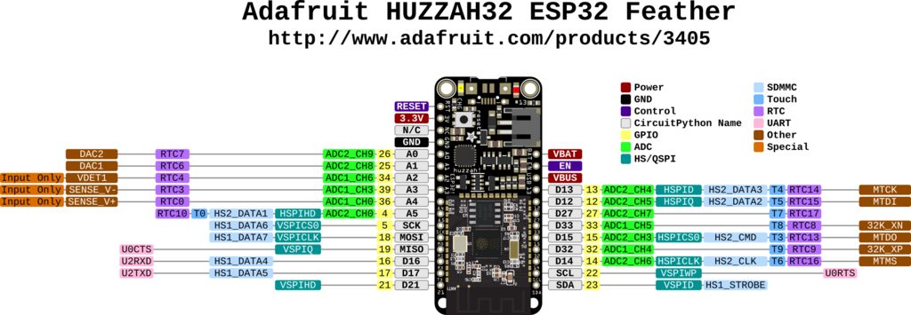

# Wokwi exercise 2 Breadboard

Open the link to the exercise on the Wokwi platform: [https://wokwi.com/projects/450404356511549441](https://wokwi.com/projects/450404356511549441).

<br>
In this exercise, we will work with our ESP32 device (similar to Feather HUZZAH32) on a breadboard. This is similar to the way you will be working with your device throughout the course.

<br>

You can see:
- ESP32 device
- Bread Board
- Button
- Several wire connections prepared for your convenience

<br>

## Goal of this exercise

In the first part of this exercise, we will not be programming. We will make use of pins on ESP32 that are permanently connected to ground (GND) and 3.3V. 

> ⚠️ Ground pins are also called negative pins. This is becasue your device can run on battery in which case it would not be possible to truly ground it. 

<br>

## Connecting two LEDs


You see a breadboard with an ESP32 device. GND and 3.3V are connected to the power railings on both sides of the breadboard. 

<br>

## ADD red LED and a 1 kΩ resistor

1. Connect one pin of the button to a 3.3 V positve railing.
2. Connect the other pin on the same side to a 1 kΩ resistor.
3. Add an RED LED to the opposite side of the resistor. 
   1. > You will need to rotate the LED, otherwise the two leads will be connected together to the same row. 
4. Connect the second pin of the LED to the negative railing (GND). 
5. Start the simulation by pressing the "play" button on the top of the screen. Wait for a moment until you see `Hello, ESP32!` written in the command line output. 
6. Upon pressing the button, you should see an LED light up. 

 > :bulb: If you don't see your LED light up, check its polarity. LED is typically not damaged by plugging it "in reverse" unless it exposed to a damaging voltage level. But when plugged "in reverse" any diode, including the light emitting on (LED) will not conduct electricity and in the case of LED it will not light up. 

<br>

 ## Add a second blue LED and a 1 kΩ resistor

 Add another, this time blue, LED to a terminal that is always powered up (connected to 3.3 V). That is a terminal on the opposite side of the one you have connected your 3.3 V. 

<br>

 

 <br>

 :warning: Do not forget to include a 1 kΩ resistor to protect the LED and your ESP32 device! 

 After plugging your LED and your resistor, try the simulation again. Note how differently your LEDs are reacting to you pressing the button this time.

 <br>

 ## Reading button output

 You will find it useful for your project to be able to communicate with your program, for instance in order to stop it. For that, you will need to be able to read a value from a button back into your HUZZAH32. 

 To get to read a digital pin value, you can simply declare it as a `Pin.IN` as opposed to `Pin.OUT` which we used so far. This means that you need to add the following in your code header:

 ```python
 button = Pin(<num>, Pin.IN, Pin.PULL_DOWN)
 # Where <num> needs to be replaced by your pin of choice
 ``` 

 > :bulb: Notice also a new setting we provide, a `Pin.PULL_DOWN`. This is adding an internal pull down resistor. This adds a resistor with very high resistance (typically 10kΩ or more). This resistor provides a weak pull towards ground, which can however overriden easily by external output. This avoids so called "floating voltage", which is your device picking up electromagnetic waves from the environment, much in the same fashion as a radio would. A pin can also be pulled up if the resistor is connected to a e.g. 3.3 V.  

To help you choose a pin as an input, here is the pinout for HUZZAH32. It may look complicated, but for now you we are only interested in the small yellow labels second closest to the device. These are non-dedicated pins which are available for us to use.  

 

 > :bulb: Some pins have other functions too, such as communication with other devices (e.g. pin 22 and 23, which are also Serial DAta line (SDA) and Serial CLock line (SCL) used in I2C communication protocol used to talk to other devices).

After declaring a pin as an input, you can read its value with the `button.value()` function. To monitor whether a button is pressed at any moment, you need to use a `while True:` endless loop. This time you shouldn't use any delay, so your loop will re-occur very quickly. This way we ensure catching the button press. 

You will also need to test whether a button is pressed. For this we need a so called `if` statement. You should add this `if` statement to your `while` loop to check whether a button is pressed in every iteration of this loop. Since your pin is pulled down, it will normally be at state "down" or programmatically speaking `0` and once the button is pressed it will turn to "up" or `1`. This means that your `if` statement might look like this:

```python
if button.value() == 1:
    # Here goes a code you want to execute when a condition is met.
```

We want to complicate things a bit further. We want to keep track of how many times we pressed the button. To that end, create a variable `n` before your while loop and assign zero to it `n = 0`. And when button is pressed, add `1` to it.

To follow what is going on, add also a `print()` statement. You should include the number of times the button was pressed. You can use an "f string formatting" to make it easier. In your case it would look like this `print(f"Button pressed {n} times")`. Note the `f"` construct at the beginning of the string and the `{}` which hold variable names that should be translated into their values.

:warning: Observe the outcome in the command line carefully. It will not be working very well. We will talk about the reason why in the upcoming short lecture.