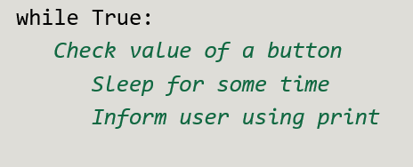
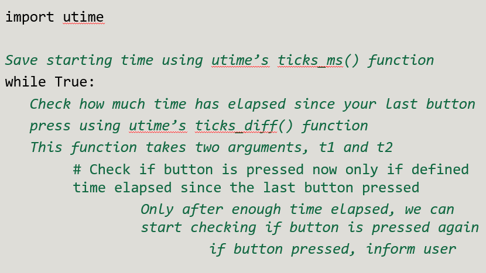

# Wokwi exercise 3: Button Debounce

In this exercise, you should continue in your previous Wokwi workplace. 

## Goal of the exercise

The goal of this short exercise is to implement a simple debounce for your button.

You can choose whether to implement a blocking or non-blocking code. There likely is no major functonal advantage to either within the design of your device.

| Header | Intro message | 
| ------ | ------------- | 
|  | 

:warning: Observe the outcome in the command line carefully. Hopefully, it will work better this time. If you still get multiple clicks, try varying the amount of "idle" time in your code. That is your sleep time or the `ticks_diff()` value. 