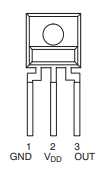

# Exercise 7: Hardware debugging

Whenever interacting with a new piece of hardware, we need to test it with simple case scenario. Even straight from a factory, it may happen that some pieces are faulty. Let's go through several simple case scenarios to test our hardware components. 

>:warning: This is a group exercise. Wait for all of the members of your group to be ready to follow along. 

## Checking resistors

Typically resistors are quite reliable and terefore we will not be actively checking them in this course. If you have any doubts, you can always use the multimeter available in the class to check the resistance value of your resistor. 

## Checking LED

It may happen that your LED is faulty or broken. Before starting, you should check its performance. 

### Checking internal LED

Internal LED of the HUZZAH32 is connected to the  pin 13. We will start by checking its performance first. The following step does not require any wiring, only USB connection to your computer.

1. Set up pin 13 as an output pin in the same way you have done in Wokwi (no wiring requred).
2. Write a short script with an infinite while loop that drives pin 13 as high and low. Don't forget to put a sleep function to wait for a while between each change. 

**Expected outcome**: A small red LED on the HUZZAH32 is blinking.

----

### Checking supplied LEDs

Now that we have a script that we are sure works, we can proceed to check the supplied color LEDs. We will take advantage of the fact that the same pin 13 that drives internal LED also drives a physical pin with the same number (13) on the HUZZAH32.

We will proceed to connect a physical LED to the pin 13. 
> :warning: Remember that you **HAVE TO ADD A RESISTOR IN SERIES WITH YOUR LED** to protect it and the pin of HUZZAH32.
>  
> :bulb: Keep in mind that an LED has a polarity. That means that it conducts electricity and lights up only in one direction. In the opposite direction it does not allow the passage of current. Connecting LED in the opposite direction will not damage it as long as it is within an appropriately designed circuit (appropriate voltage and current), but will not light up. 
> 
> 
> Check the polarity of the LED.

Once connected, the external LED should light up at the same time as the internal red LED. 

#### Troubleshooting:

| Problem                     | Solution                                        |
| --------------------------- | ----------------------------------------------- |
| Neither LED lights up       | Check the LED polarity.                         |
|                             | Unplug extrnal LED and only the internal again. |
| Only internal LED lights up | Check the exernal LED polarity.                 |
|                             | Ensure that you are connected to pin 13.        |
|                             | Make sure you have a correct resistor in series with your LED. |

If you have checked the above points and your LED still does not light up, it might be faulty. 

> :bulb: If you are unsure about your LED at any point in the future, you can always come back to this test to verify its performance. 

## Checking a button 

Connect your button following one of our previous Wokwi exercises. Connect it to stable GND (ground) and 3.3 V pins of the HUZZAH32. Connect an LED (remember a resistor in series!) and check that it lights up when button is pressed. 

#### Troubleshooting

| Problem                     | Solution                                        |
| --------------------------- | ----------------------------------------------- |
| LED is always on            | Make sure to connect your LED **across** from your 3.3 V pin. Review the button wiring in exercise 2. | 
| LED does not light up when button is pressed | Ensure correct polarity of the LED. |
|                             | Check LED series resistor value. |

## Checking sensor operation

In the following section, we will work with the light sensor. You can find its technical datasheet on DTU Learn. Bellow is a pinout of the sensor. The pins are shown with the detector facing towards you:

 

| Terminal | Function                     |
| -------- | ---------------------------- |
| GND      | Ground                       |
| $V_{DD}$ | Supply voltage (3.3 V)       |
| OUT      | Output (measurement) voltage |

 

Connect the pin 1 to HUZZAH32's ground and pin 2 to a 3.3 V pin. Bellow is the wiring diagram:

 

You can see a resistor $R_{L}$ branching off the output lead. This is a so called "pull down" resistor. This is a high resistance resistor that is used to prevent stray current induced in the wire. The technical sheet quotes pull down resistor value of 10 kΩ (page 6 Note 1) and that is what we will use as well.

Once pull down resistor is installed, you can proceed to connecting the output pin to an ADC enabled pin on HUZZAH32 (pin A1 to A5 - see bellow). 

Once all is connected, you can proceed to programming. You can use some of the code from the ADC exercise. Construct a simple infinite `while` loop that reads value from your selected pin and print this value to a serial monitor using the print function every 0.5 s or so. Don't forget to assign an appropriate `.atten` value of 11 DB to your ADC pin.

#### Expected outcome

A voltage is read continuously and displayed through the serial monitor connection on a connected computer. The sensor should be saturated at an ambient light value, but pinching it lighlty between two fingers should reduce the read voltage value significantly. 